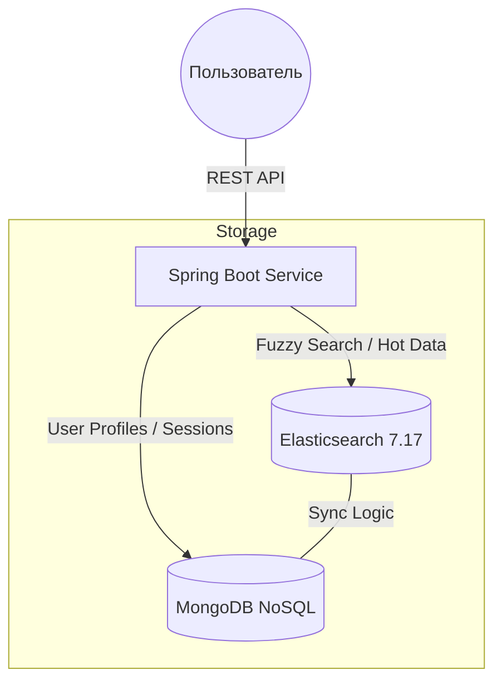

<div align="center">
  

  <p align="center">
    <strong>Высокопроизводительный поисковый движок для e-commerce с поддержкой нечеткого поиска и гибридного хранения данных.</strong>
  </p>

  
  
  
  
  
</div>

---

### 🎯 Обзор проекта
**SmartTech Search API (FCS)** — это специализированный бэкенд для интернет-магазинов электроники. Главная цель проекта — обеспечить мгновенный отклик при поиске по огромным каталогам товаров, учитывая человеческий фактор (опечатки, сленг, неточные запросы).

**Проблема:** Медленная фильтрация и «нулевая» выдача при опечатках.
**Решение:** Использование Elasticsearch с алгоритмом расстояния Левенштейна и динамическое построение фасетов (фильтров) на лету.

---

### 🏗 Архитектура системы
Проект использует **Hybrid Data Storage Strategy** для разделения ответственности между хранилищами:




* **Hot Data (Elasticsearch):** Названия, бренды, динамические характеристики. Оптимизировано для FPS (Fast Processing Speed).
* **Persistent Data (MongoDB):** Профили, списки сравнения, безопасность.

---

### 🔥 Ключевые возможности

* **Smart Fuzzy Search:** Корректная обработка запросов типа `samssung` → `Samsung`, `aifon` → `iPhone`.
* **Dynamic Filtering:** Автоматическая генерация дерева фильтров на основе текущей выборки товаров.
* **Legacy-Modern Bridge:** Уникальная интеграция `RestHighLevelClient` (Elastic 7) в современную среду Spring Boot 3.2+ на Java 21.
* **Fault Tolerance:** Система сохраняет работоспособность (Graceful Degradation) даже при временной недоступности поискового движка.

---

### 🛠 Технический стек (Deep Dive)

* **Backend:** Java 21 (Records, Pattern Matching), Spring Boot 3.2.5.
* **Search Engine:** Elasticsearch 7.17 (Fuzzy Search, Aggregations).
* **NoSQL:** MongoDB (User Management, Comparison Lists).
* **Security:** Кастомная аутентификация через Session Cookies и SHA-1 хеширование для совместимости с Legacy-базами.
* **DevOps:** Контейнеризация через Docker, оркестрация зависимостей через Docker Compose.

---

### 🚀 Быстрый запуск

#### 1. Поднятие инфраструктуры

Проект поставляется с готовым `docker-compose.yml` для развертывания баз данных:

```yaml
version: '3.8'
services:
  elasticsearch:
    image: docker.elastic.co/elasticsearch/elasticsearch:7.17.21
    environment: [ "discovery.type=single-node", "xpack.security.enabled=false" ]
    ports: [ "9200:9200" ]
  mongodb:
    image: mongo:latest
    ports: [ "27017:27017" ]

```

#### 2. Запуск приложения

```bash
# Клонирование репозитория
git clone [https://github.com/your-username/smarttech-search-api.git](https://github.com/your-username/smarttech-search-api.git)

# Запуск контейнеров
docker-compose up -d

# Сборка и запуск Spring Boot приложения
./mvnw spring-boot:run

```

---

### 📂 Основные эндпоинты API

| Метод | Эндпоинт | Описание |
| --- | --- | --- |
| `GET` | `/search-all` | Полнотекстовый поиск с фильтрацией |
| `POST` | `/reg` | Регистрация нового пользователя в MongoDB |
| `GET` | `/compare` | Получение JSON для сравнения характеристик |
