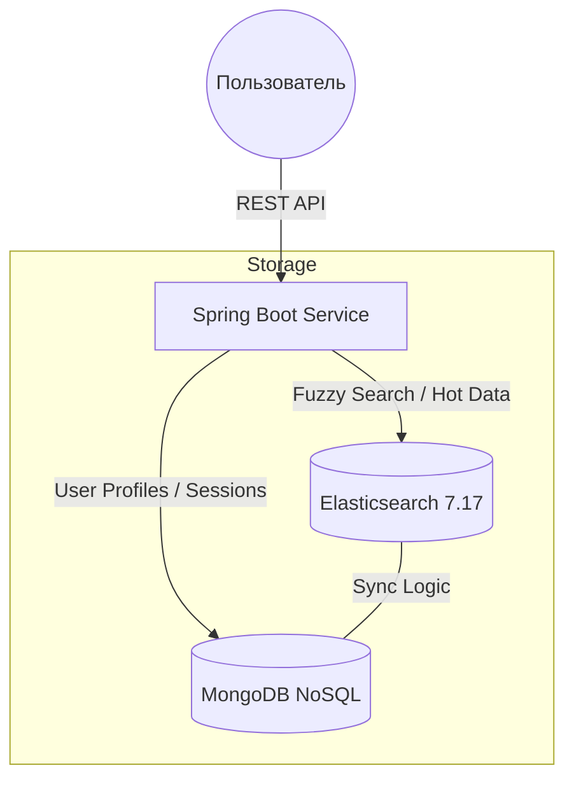

<div align="center">
  

  <p align="center">
    <strong>Высокопроизводительный поисковый движок для e-commerce с поддержкой нечеткого поиска и гибридного хранения данных.</strong>
  </p>

  
  
  
  
  
</div>

---

### 🏆 Признание и награды
Проект стал **призёром Всероссийского конкурса IT-проектов** (секция «Программные продукты, мобильные и веб-приложения»), организованного **Казанским федеральным университетом (КФУ)**.

* **Статус:** Диплом призёра
* **Конкурс:** Всероссийский конкурс проектов в области ИТ (Kazanforum.doc)
* **Организатор:** СУНЦ КФУ / ИТ-лицей КФУ

---

### 🎯 Обзор проекта
**SmartTech Search API (FCS — Fast Service Catalog)** — это специализированный бэкенд для интернет-магазинов электроники. Проект решает проблему медленной фильтрации и «нулевой» выдачи при опечатках пользователя благодаря интеграции Elasticsearch и Java 21.

---

### 🏗 Архитектура системы
В проекте реализована стратегия **Hybrid Data Storage** для оптимального распределения нагрузки:




---

### 🔥 Ключевые возможности

* **Smart Fuzzy Search:** Автоматическое исправление опечаток (алгоритм Левенштейна).
* **Dynamic Filtering:** Генерация дерева доступных фильтров в реальном времени.
* **Legacy-Modern Bridge:** Работа с `RestHighLevelClient` в среде Spring Boot 3.2+ и Java 21.
* **Fault Tolerance:** Устойчивость к сбоям поискового движка (Graceful Degradation).

---

### 🛠 Технический стек

* **Core:** Java 21, Spring Boot 3.2.5, Project Lombok.
* **Search:** Elasticsearch 7.17 (RestHighLevelClient).
* **Database:** MongoDB (Sync Driver).
* **Infrastructure:** Docker, Docker Compose.

---

### 🚀 Быстрый запуск

#### 1. Поднятие инфраструктуры

```yaml
version: '3.8'
services:
  elasticsearch:
    image: docker.elastic.co/elasticsearch/elasticsearch:7.17.21
    environment: [ "discovery.type=single-node", "xpack.security.enabled=false" ]
    ports: [ "9200:9200" ]
  mongodb:
    image: mongo:latest
    ports: [ "27017:27017" ]

```

#### 2. Команды запуска

```bash
docker-compose up -d
./mvnw spring-boot:run

```
